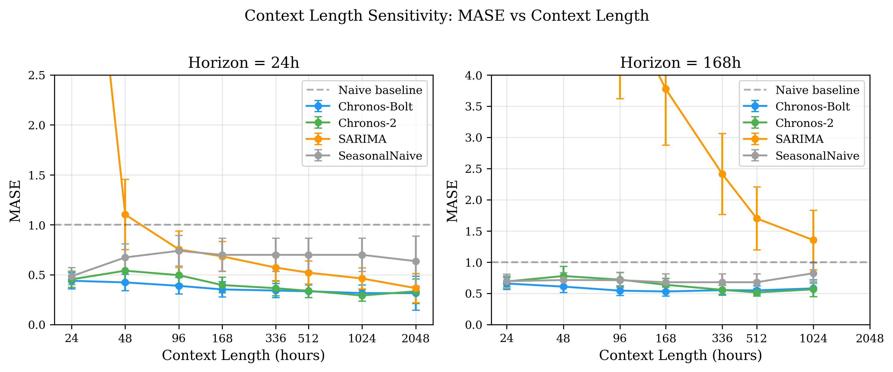

# Energy Load Forecasting Benchmark

A rigorous benchmark comparing **Time Series Foundation Models** against **statistical baselines** for electricity demand forecasting on ERCOT data.



## Key Findings

Our context length sensitivity study reveals:

| Model | Best MASE | Inference Time | Type |
|-------|-----------|----------------|------|
| **Chronos-Bolt** | 0.315 | 0.1s | Foundation Model |
| **Chronos-2** | 0.334 | 0.09s | Foundation Model |
| SARIMA | 0.365 | 6.2s | Statistical |
| Seasonal Naive | 0.591 | <0.01s | Baseline |

**Main insights:**
- Foundation models significantly outperform baselines (p<0.001)
- Longer context improves accuracy for all models (no saturation up to 2048h)
- Foundation models are ~60x faster than SARIMA on CPU
- SARIMA needs >500h of history to achieve competitive accuracy

## Models Evaluated

### Foundation Models
- **Chronos-Bolt** (Amazon) - Fast encoder-decoder architecture
- **Chronos-2** (Amazon) - Latest encoder-only with grouped query attention

### Statistical Baselines
- **SARIMA** - Seasonal ARIMA(2,1,2)(1,1,1,24)
- **Seasonal Naive** - Repeat last week (168h seasonality)

## Dataset

**ERCOT Hourly Load Data** (2020-2024)
- Source: EIA Open Data API
- 43,732 hourly observations
- Texas electricity grid demand

## Installation

```bash
# Clone repository
git clone https://github.com/[your-username]/energy-load-forecasting-benchmark.git
cd energy-load-forecasting-benchmark

# Install dependencies
pip install -e ".[dev]"

# Download data
python scripts/download_data.py
```

## Quick Start

### Run the Context Length Experiment

```bash
# Full experiment (~50 minutes on CPU)
python experiments/context_length_study/run_experiment.py

# Quick test (3 minutes)
python experiments/context_length_study/run_experiment.py --test

# Generate figures
python experiments/context_length_study/analyze_results.py
```

### Interactive Demo

```bash
streamlit run demo/streamlit_app.py
```

## Project Structure

```
energy-load-forecasting-benchmark/
├── src/energy_benchmark/
│   ├── data/           # Data loaders (ERCOT via EIA API)
│   ├── models/         # Model wrappers (Chronos, SARIMA, etc.)
│   └── evaluation/     # Metrics and benchmark runner
├── experiments/
│   └── context_length_study/
│       ├── run_experiment.py      # Main experiment
│       ├── analyze_results.py     # Statistical analysis
│       └── results/               # Figures and data
├── demo/
│   └── streamlit_app.py           # Interactive demo
└── scripts/
    └── download_data.py           # Data download script
```

## Experiment Details

See [experiments/context_length_study/README.md](experiments/context_length_study/README.md) for:
- Full experimental design
- Reproducibility instructions
- Statistical analysis methodology

## Citation

```bibtex
@misc{energy-load-forecasting-benchmark,
  title={Context Length Sensitivity in Time Series Foundation Models:
         An Energy Load Forecasting Benchmark},
  author={[Your Name]},
  year={2026},
  url={https://github.com/[your-username]/energy-load-forecasting-benchmark}
}
```

## License

MIT License
